# Simple POS

A modern, lightweight Point of Sale (POS) system built with **Tauri v2** and **Next.js 16**, designed for performance and simplicity.

## Features

- **Point of Sale Interface**: Fast and intuitive interface for processing sales.
- **Product Management**: Add, update, and remove products with details like price, category, and images.
- **Checkout Payment**: 
  - **Virtual Numpad**: Optimized touchscreen numeric keypad for quick cash entry.
  - **Smart Change Calculation**: Automated change display with validity checks.
  - **Responsive Layout**: Optimized for 1080x720 (3:2 Aspect Ratio) and scales up to 4K.
  - **Receipt Generation**: Backend integration for transaction recording.
- **Customizable UI**:
  - **Global Display Scaling**: Adjust the entire interface size from 50% to 200%.
  - **Granular Control**: Independently resize the Sidebar, Cart panel, and Product Grid density.
- **Order History**: 
  - View past transactions with date filtering.
  - Search receipts by unique ID.
  - Detailed receipt view with items and pricing.
- **Category Management**: Organize products into custom categories for easier navigation.
- **Settings**: Configure tax, currency, and display preferences.
- **Cross-Platform**: Runs natively on Linux, macOS, and Windows.

## Tech Stack

- **Frontend**: [Next.js 16](https://nextjs.org/) (React 19), [Tailwind CSS 4](https://tailwindcss.com/)
- **Backend**: [Tauri v2](https://v2.tauri.app/) (Rust)
- **Database**: SQLite (via Diesel ORM in Rust)
  - **Automatic Path Resolution**: Uses `directories` crate to store data securely in the system's local data directory (e.g., `~/.local/share/simple-pos` on Linux).
- **State Management**: React Hooks & Context

## Prerequisites

Before you begin, ensure you have the following installed:

- **Node.js** (v20 or newer recommended)
- **Rust & Cargo** (latest stable)
- **System Dependencies**:
  - **Linux**: Build essentials, webkit2gtk (see [Tauri Linux Setup](https://v2.tauri.app/start/prerequisites/#linux))
  - **macOS**: Xcode Command Line Tools
  - **Windows**: Microsoft Visual Studio C++ Build Tools

## Setup & Development

1. **Clone the repository**
   ```bash
   git clone <repository-url>
   cd simple-pos
   ```

2. **Install dependencies**
   ```bash
   npm install
   ```

3. **Run in Development Mode**
   This command starts both the Next.js frontend and the Tauri application window.
   ```bash
   npm run tauri dev
   ```
   > **Note for Linux Users**: The `tauri` script in `package.json` automatically sets `WEBKIT_DISABLE_DMABUF_RENDERER=1` to prevent rendering issues. Using `npm run tauri dev` ensures this is applied.

## Building for Production

To build a standalone executable for your operating system:

```bash
npm run tauri build
```

The output binary will be located in `src-tauri/target/release/bundle/`.

## Architecture



## Project Structure

- **`src/`**: Next.js frontend source code.
  - `app/`:
    - `components/`: Reusable React components.
      - `payment/`: New PaymentModal sub-components (`VirtualNumpad`, `CashInput`, `ModalHeader`, etc.).
      - `POSClient`, `Cart`, etc.
    - `history/`: Order history page and related components.
    - `manage/`: Management interface for products and categories.
    - `setting/`: Settings page implementation.
    - `lib/`: Utility functions and API wrappers (`api.ts`).
- **`src-tauri/`**: Rust backend source code.
  - `src/`: Core Rust source files (`main.rs`, `lib.rs`, `commands/`).
  - `database/`: Local crate for database interactions.
  - `export_lib/`: Local crate for handling exports.
  - `tauri.conf.json`: Tauri configuration file.
