# Tauri Backend Architecture

This directory contains the Rust backend for the Simple POS application, built with Tauri v2.

## Architecture

## Structure

- **`src/`**: Core Rust source files (`main.rs`, `lib.rs`, `commands/`).
- **`database/`**: Local crate for database interactions (Diesel ORM).
- **`export_lib/`**: Local crate for handling data exports.
- **`tauri.conf.json`**: Tauri configuration file.

## Prerequisites

### Windows
- **Microsoft Visual Studio C++ Build Tools**
- **OpenSSL**: Required for `sqlcipher`.
  - Install OpenSSL (v1.1 or v3.0).
  - Set `OPENSSL_DIR` (e.g., `C:\Program Files\OpenSSL-Win64`).
  - Set `OPENSSL_LIB_DIR` (e.g., `C:\Program Files\OpenSSL-Win64\lib\VC\x64\MD`).
  - Set `OPENSSL_INCLUDE_DIR` (e.g., `C:\Program Files\OpenSSL-Win64\include`).

## Key Commands

The backend exposes several commands to the frontend:

- **Product & Stock**:
  - `get_products`, `create_product`, `update_product`, `delete_product`
  - `get_stock`, `get_all_stocks`, `insert_stock`, `update_stock`, `remove_stock`
- **Transactions**:
  - `create_invoice`: Create a new sale record.
  - `get_invoices_by_date`, `get_invoice_detail`: Retrieve order history.
  - `process_transaction`: Handle sales logic (deprecated/internal).
- **Categories**:
  - `get_categories`, `create_category`, `update_category`, `delete_category`
- **Images**:
  - `save_image`: Save uploaded image to local storage.
  - `link_product_image`, `unlink_product_image`: Manage product-image relationships.
- **Settings**:
  - `get_settings`, `save_settings`: Manage application settings (persisted to `settings.json` in user data directory).
- **Export**:
  - `export_receipts`: Export transaction data to CSV/Excel/ODS.
- **System**:
  - `initialize_database`, `check_database_exists`
