# Tauri Backend Architecture

This directory contains the Rust backend for the Simple POS application, built with Tauri v2.

## Architecture

## Structure

- **`src/`**: Core Rust source files (`main.rs`, `lib.rs`, `commands/`).
- **`database/`**: Local crate for database interactions (Diesel ORM).
- **`export_lib/`**: Local crate for handling data exports.
- **`tauri.conf.json`**: Tauri configuration file.

## Prerequisites

### Windows
- **Microsoft Visual Studio C++ Build Tools**
- **OpenSSL**: Required for `sqlcipher`.
  - Install OpenSSL (v1.1 or v3.0).
  - Set `OPENSSL_DIR` (e.g., `C:\Program Files\OpenSSL-Win64`).
  - Set `OPENSSL_LIB_DIR` (e.g., `C:\Program Files\OpenSSL-Win64\lib\VC\x64\MD`).
  - Set `OPENSSL_INCLUDE_DIR` (e.g., `C:\Program Files\OpenSSL-Win64\include`).

## Key Commands

The backend exposes several commands to the frontend:
- **`get_settings` / `save_settings`**: Manage application settings (persisted to `settings.json` in user data directory).
- **`get_products` / `create_product`**: CRUD operations for products.
- **`process_transaction`**: Handle sales and stock updates.
