# Database Module

This crate `simple-pos-database` manages the data persistence layer for the Simple POS application. It uses **Diesel ORM** with **SQLite** to handle database operations.

## Architecture

The module is structured to separate concerns between connection management and domain-specific logic.



### Modules

- **lib.rs**: The library entry point.
- **connection.rs**: Handles the SQLite connection pool.
- **Domain Modules**:
  - `product`: Manages product data (barcode, name, price, etc.).
  - `category`: Manages product categories.
  - `stock`: Manages inventory levels for products.
  - `receipt`: Handles sales transactions and receipt generation.
  - `image`: Manages image metadata and file paths.
  - `product_image`: Handles the relationship between products and images.

## Database Schema

The following ER diagram illustrates the relationships between the database entities.



### Entities

- **CATEGORY**: Groups products (`id`, `name`, `color`, `icon`).
- **PRODUCT**: Items for sale (`id`, `name`, `price`, `image`, `sku`, `category_id`).
- **STOCK**: Inventory tracking (`id`, `product_id`, `quantity`, `updated_at`).
- **RECEIPT**: Sales transactions (`id`, `total`, `payment_type`, `created_at`).
- **RECEIPT_ITEM**: Line items for receipts (`id`, `receipt_id`, `product_id`, `quantity`, `price`).
- **IMAGES**: Image file metadata (`id`, `file_name`, `file_hash`, `file_path`, `created_at`).
- **PRODUCT_IMAGES**: Link between products and images (`product_id`, `image_id`).

> **Note**: Application settings (currency, tax, layout) are **not** stored in the database. They are persisted in a JSON file (`settings.json`) in the user's data directory.

## Development

### Prerequisites

- Rust (latest stable)
- Diesel CLI: `cargo install diesel_cli --no-default-features --features sqlite`

### Setup

1.  Ensure `.env` is configured with `DATABASE_URL`.
2.  Run migrations:
    ```bash
    diesel migration run
    ```
